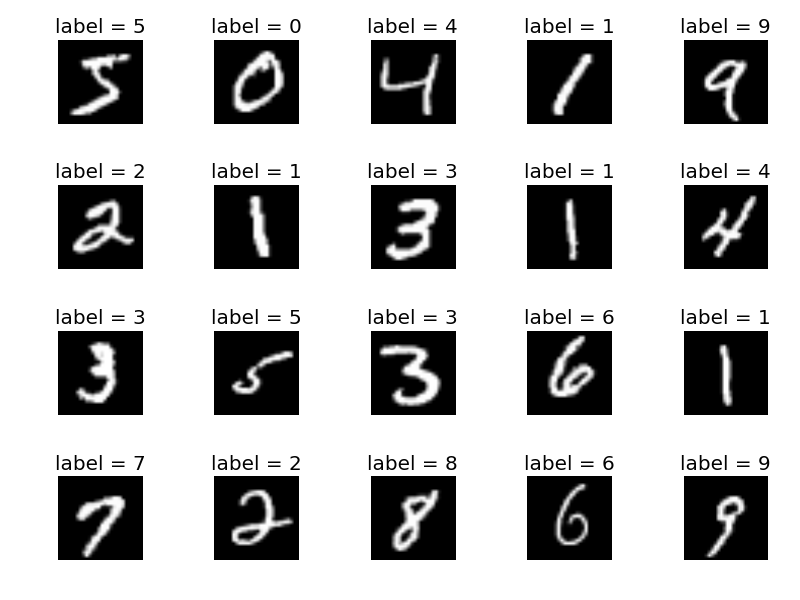

# VanillaGAN-MNIST-Keras

Standard GAN implemented on top of keras/tensorflowGPU applied to the MNIST dataset.

## Vanilla GAN
Vanilla GANs are the simplest type of GAN and in this case the generator and the discriminator are just simple multi-layer perceptrons. Vanilla GANs simply just seek to optimize the mathematical equation using stochastic gradient descent.

This is the algorithm for the very first GAN. It was taken from the [paper](https://arxiv.org/abs/1406.2661) written by Goodfellow et al. in 2014:

## Data
The dataset used for this project is the MNIST dataset composed of a 70,000 images of handwritten numbers.

## Results
This is the progress on the Generator of my Vanilla GAN in only 100 epochs!

